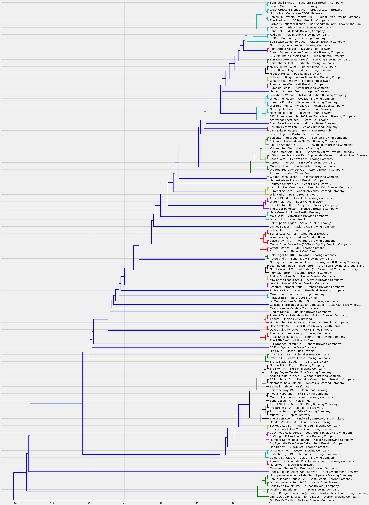

# Hierarchical-Classification-Beers

This project implements a bottom-up, hierarchical classification algorithm and applies it to several datasets of beer data. The goal is to cluster similarly flavored beers close to one another for use in informing prduct selection.

Please refer to Report.docx for a more detailed summary of the project.

main.py - run this file

Utilfn.py - contains all functions used by main.py

